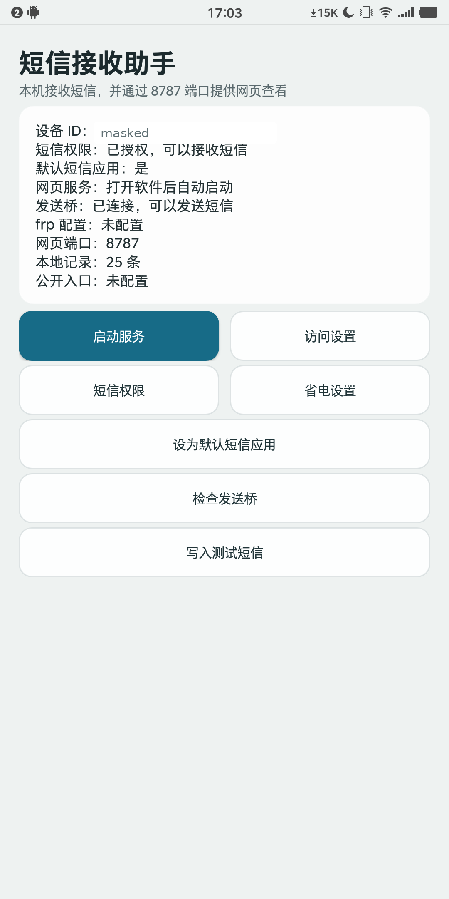
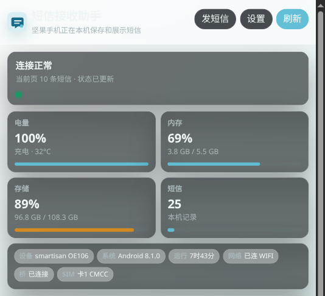
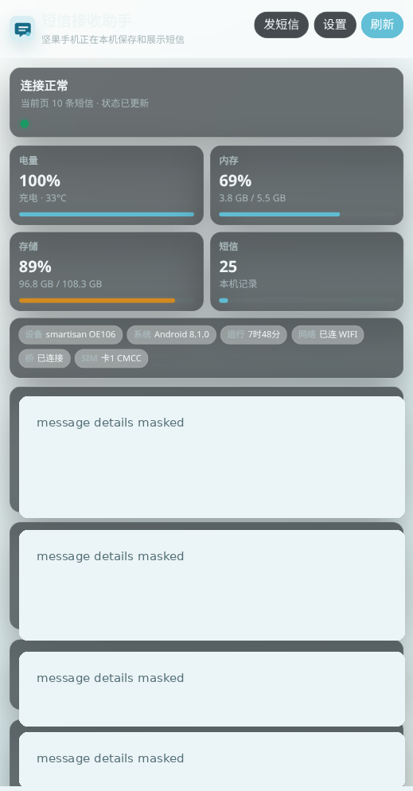
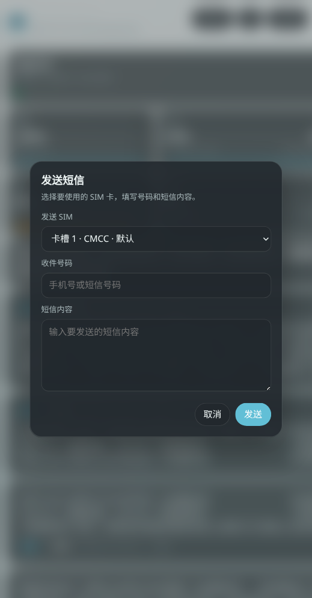
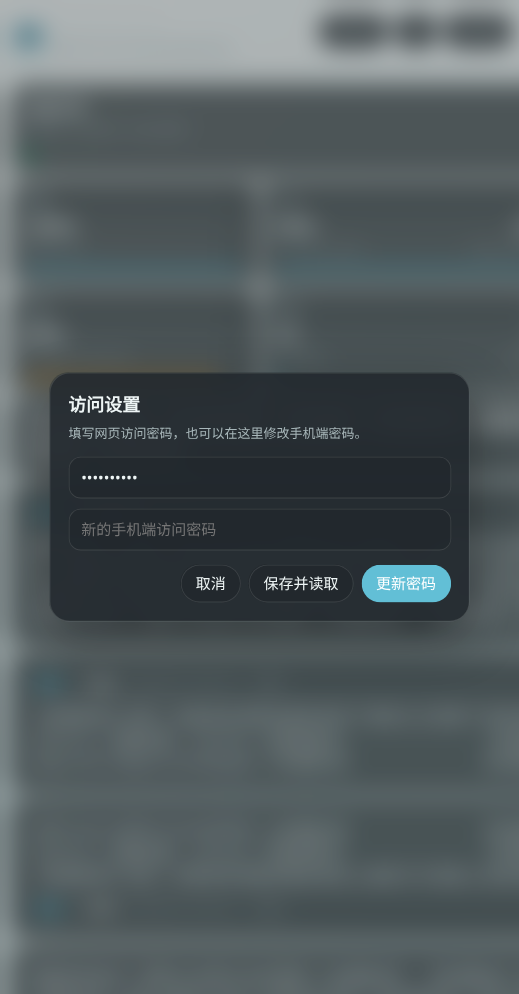

# Remote SMS / 短信接收助手

把一台放在家里的 Android 手机变成可自托管的短信收发网关。手机负责接收、保存和发送短信，网页端负责远程查看、分页浏览、选择 SIM 卡发送短信，并展示设备状态。

Turn an Android phone that stays at home into a self-hosted SMS gateway. The phone receives, stores, and sends SMS messages, while the web UI lets you read messages remotely, send from a selected SIM card, and monitor device health.

---

## 中文文档

### 这个项目解决什么痛点

很多人手里会有一台“专门接短信”的备用手机：银行卡、平台账号、工作号码、海外/异地号码、不能开 eSIM 的实体卡、双卡甚至多卡场景，都可能让你不得不多带一台手机出门。Remote SMS 的目标很直接：手机可以放在家里或办公室，只要它开机、有信号、有网络，你就能通过浏览器远程收发短信。

典型场景：

- 不用再随身带好几台手机，验证码短信远程查看即可。
- 适合无法使用 eSIM、必须保留实体 SIM 卡的号码。
- 适合多 SIM 卡用户，可以选择指定 SIM 发送短信。
- 适合把备用号码、工作号码、注册专用号码放在固定地点集中管理。
- 适合异地号码、低频使用号码、IoT/流量卡关联号码等不方便随身携带的场景。
- 适合临时在电脑、平板或另一台手机上通过网页查看短信。
- 适合自建、内网穿透、家庭路由器、frp 等轻量部署场景，不必依赖第三方短信同步平台。

### 项目亮点

- **手机即服务端**：Android App 内置 Web 服务，默认监听 `8787` 端口，不需要额外部署后端。
- **远程收发短信**：网页端可以读取短信，也可以提交发送短信。
- **多 SIM 卡支持**：发送短信时可以选择具体 SIM 卡，适合双卡和多卡使用。
- **设备状态看板**：网页端展示电量、内存、存储、网络、运行时间、短信数量、SIM 信息、发送桥状态等。
- **移动端友好**：网页 UI 针对小屏手机做了紧凑布局，可以直接用另一台手机访问。
- **访问密码保护**：所有受保护接口都需要 Bearer Token，访问密码可在 App 或网页设置里修改。
- **frp 配置独立管理**：frp 地址、端口、认证信息、访问密码都不硬编码，统一在 App 设置里配置。
- **发送状态记录**：发出的短信会写入本地记录，网页端能看到发送中、已发送、发送失败等状态。
- **Smartisan 兼容处理**：针对 Smartisan Pro 2S 上普通 `SmsManager` 调用被系统吞掉的问题，提供本地 shell 发送桥方案。
- **自托管优先**：数据保存在手机本地，适合自己掌控访问入口和部署方式。

### 界面预览

截图中的设备 ID、短信号码和消息列表已脱敏。











### 项目结构

- `android/`：Android App。负责接收短信、本地存储、内置网页服务、发送短信和设备状态展示。
- `tools/sms-bridge/`：Smartisan OS 等特殊机型使用的 shell 侧短信发送桥。
- `tools/start-phone-services.sh`：启动手机侧辅助服务的脚本。
- `server/`：旧版 Node.js Web/API 服务，保留用于桌面调试或兼容测试。

### 工作方式

1. Android 手机安装并打开 App。
2. App 自动启动本机 Web 服务，端口为 `8787`。
3. 手机接收到短信后写入本地记录。
4. 浏览器访问手机的 Web 服务，通过访问密码读取短信。
5. 需要发送短信时，在网页端选择 SIM 卡、填写号码和内容。
6. 网页端可以同时查看手机电量、存储、内存、网络、SIM、发送桥等状态。

本地 USB 调试时可以使用：

```sh
adb forward tcp:8787 tcp:8787
```

然后浏览器打开：

```text
http://127.0.0.1:8787
```

局域网或内网穿透部署时，可以访问：

```text
http://<phone-ip>:8787
```

或通过你自己的 frp、公网域名、反向代理入口访问。

### 配置说明

App 不会在代码里硬编码 frp 地址、frp token 或网页访问密码。

打开 Android App，进入 **访问设置**，可以配置：

- 网页访问密码
- 公网访问地址
- frp 服务器地址
- frp 服务器端口
- frp 远端端口
- frp 认证 token

这些值只保存在手机本地的 Android `SharedPreferences` 中。

### Smartisan 短信发送桥

在已测试的 Smartisan Pro 2S 上，普通 App UID 调用 `SmsManager` 时系统会接受请求，但短信不会真正到达基带发送流程。项目提供了一个本地 shell 侧发送桥，通过 Android `isms` 服务提交短信。

构建并推送发送桥：

```sh
javac -source 8 -target 8 \
  -bootclasspath .tools/android-sdk/platforms/android-35/android.jar \
  -d /tmp/sms-bridge-build/classes \
  tools/sms-bridge/SmsBridge.java

.tools/android-sdk/build-tools/35.0.0/d8 \
  --min-api 23 \
  --output /tmp/sms-bridge-build/dex \
  /tmp/sms-bridge-build/classes/SmsBridge*.class

cd /tmp/sms-bridge-build/dex
zip -q /tmp/sms-bridge.jar classes.dex

adb shell 'mkdir -p /data/local/tmp/sms-bridge'
adb push /tmp/sms-bridge.jar /data/local/tmp/sms-bridge/sms-bridge.jar
adb push tools/start-phone-services.sh /data/local/tmp/sms-bridge/start-phone-services.sh
adb shell 'chmod 755 /data/local/tmp/sms-bridge/start-phone-services.sh'
```

手机重启后启动发送桥：

```sh
adb shell /data/local/tmp/sms-bridge/start-phone-services.sh
```

App 会检查 `127.0.0.1:8790/health`，并在 App 和网页状态中显示发送桥是否可用。

### API

受保护接口需要请求头：

```text
Authorization: Bearer <web-access-password>
```

接口列表：

- `GET /api/messages?limit=10&offset=0`
- `GET /api/sims`
- `POST /api/send`
- `GET /api/config`
- `POST /api/config`
- `GET /api/device`
- `GET /health`

### 安全建议

- 不建议把 `8787` 端口裸露到公网，建议配合 frp、反向代理、HTTPS、访问控制或 VPN 使用。
- 请设置足够长的网页访问密码。
- frp 认证信息和网页访问密码不要提交到 Git 仓库。
- 如果用于重要账号验证码，建议把访问入口限制在自己的设备或可信网络内。
- 手机要保持充电、信号稳定，并注意短信资费和运营商限制。

---

## English Documentation

### What Problem This Project Solves

Many people keep a spare phone just for SMS: bank verification codes, work numbers, platform accounts, regional numbers, physical SIM cards that cannot be moved to eSIM, or dual-SIM and multi-SIM setups. Remote SMS lets that phone stay at home or in the office. As long as it has power, signal, and network access, you can read and send SMS messages from a browser.

Common use cases:

- Stop carrying several phones just to receive verification codes.
- Keep physical SIM cards available when eSIM is unsupported or unavailable.
- Manage dual-SIM or multi-SIM phones and choose which SIM sends a message.
- Keep backup numbers, work numbers, and sign-up numbers in one fixed place.
- Access regional, low-frequency, IoT-related, or data-plan-linked numbers remotely.
- Read SMS from another phone, tablet, laptop, or desktop browser.
- Self-host SMS access through your own network, router, frp tunnel, or reverse proxy instead of relying on third-party SMS sync services.

### Highlights

- **Phone as the server**: the Android app includes an embedded web server on port `8787`.
- **Remote SMS inbox and sender**: read incoming messages and submit outgoing messages from the web UI.
- **Multi-SIM support**: select a specific SIM card when sending SMS.
- **Device dashboard**: view battery, memory, storage, network, uptime, SMS count, SIM information, and send-bridge status.
- **Mobile-friendly UI**: compact layout for small phones, so another phone can be the remote console.
- **Password-protected access**: protected APIs require a Bearer Token, and the password can be changed from the app or web settings.
- **No hardcoded tunnel secrets**: frp URL, server address, ports, auth token, and web password are configured in the app.
- **Outgoing message history**: sent messages are recorded locally with sending, sent, delivered, or failed status.
- **Smartisan compatibility path**: includes a local shell bridge for Smartisan Pro 2S, where normal app-level `SmsManager` calls may be silently blocked.
- **Self-hosted by design**: SMS data stays on the phone, and you control the access path.

### Screenshots

Device IDs, phone numbers, and message-list details are masked in the screenshots.


### Repository Layout

- `android/`: Android app for SMS receiving, local storage, embedded web service, sending, and device status.
- `tools/sms-bridge/`: shell-side SMS sending bridge for Smartisan OS and similar edge cases.
- `tools/start-phone-services.sh`: helper script for starting phone-side services.
- `server/`: legacy Node.js Web/API server kept for desktop testing and compatibility experiments.

### How It Works

1. Install and open the Android app on the phone.
2. The app starts an embedded web server on port `8787`.
3. Incoming SMS messages are saved locally on the phone.
4. A browser connects to the phone and reads messages after password authentication.
5. To send SMS, choose a SIM card in the web UI, enter the recipient and message body, then submit.
6. The web UI also shows device health and service status.

For USB testing:

```sh
adb forward tcp:8787 tcp:8787
```

Then open:

```text
http://127.0.0.1:8787
```

For LAN or tunnel access:

```text
http://<phone-ip>:8787
```

You can also publish it through your own frp endpoint, public domain, or reverse proxy.

### Configuration

No frp address, frp token, or web access password is hardcoded in the app.

Open the Android app and use **访问设置** to configure:

- Web access password
- Public frp URL
- frp server address
- frp server port
- frp remote port
- frp auth token

The values are stored only in Android `SharedPreferences` on the phone.

### Smartisan SMS Sending Bridge

On the tested Smartisan Pro 2S, normal `SmsManager` calls from an app UID are accepted but do not reach the radio layer. The workaround is a local bridge started by `adb shell`, which submits SMS through Android's `isms` service.

Build and push the bridge:

```sh
javac -source 8 -target 8 \
  -bootclasspath .tools/android-sdk/platforms/android-35/android.jar \
  -d /tmp/sms-bridge-build/classes \
  tools/sms-bridge/SmsBridge.java

.tools/android-sdk/build-tools/35.0.0/d8 \
  --min-api 23 \
  --output /tmp/sms-bridge-build/dex \
  /tmp/sms-bridge-build/classes/SmsBridge*.class

cd /tmp/sms-bridge-build/dex
zip -q /tmp/sms-bridge.jar classes.dex

adb shell 'mkdir -p /data/local/tmp/sms-bridge'
adb push /tmp/sms-bridge.jar /data/local/tmp/sms-bridge/sms-bridge.jar
adb push tools/start-phone-services.sh /data/local/tmp/sms-bridge/start-phone-services.sh
adb shell 'chmod 755 /data/local/tmp/sms-bridge/start-phone-services.sh'
```

Start it after a reboot:

```sh
adb shell /data/local/tmp/sms-bridge/start-phone-services.sh
```

The app checks `127.0.0.1:8790/health` and shows whether the bridge is connected.

### API

All protected endpoints require:

```text
Authorization: Bearer <web-access-password>
```

Endpoints:

- `GET /api/messages?limit=10&offset=0`
- `GET /api/sims`
- `POST /api/send`
- `GET /api/config`
- `POST /api/config`
- `GET /api/device`
- `GET /health`

### Security Notes

- Do not expose port `8787` directly to the public internet without additional protection. Use frp, a reverse proxy, HTTPS, access control, or VPN where appropriate.
- Use a strong web access password.
- Do not commit frp credentials or web passwords to Git.
- For important verification-code accounts, restrict access to trusted devices and networks.
- Keep the phone charged, connected, and within carrier SMS limits.
